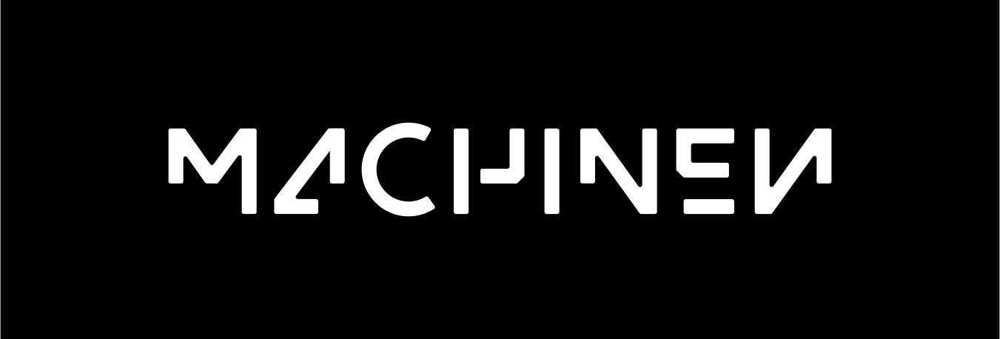
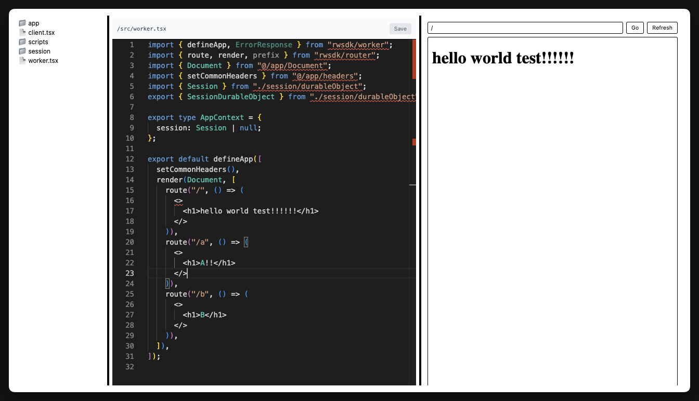

# Machinen, by RedwoodSDK



_Note: This is a preview, it does not ship to production yet. (But should by 01-August-2025.)_

We're waiting for this issue to land: https://github.com/cloudflare/workers-sdk/issues/9793

## What is Machinen?



Machinen is a browser-based text editor that connects to a Cloudflare-hosted Docker instance running Vite and RedwoodSDK.
It gives developers a development environment in the cloud, designed for agentic workflows: Each workflow runs in its own isolated container, making it easy to edit, review, and merge changes independently of each other. Developers should self-host Machinen in their own Cloudflare environment.

## Quickstart

First start up Machinen:

```bash
pnpm install
pnpm dev
```

Then in another terminal, you can "emulate the Docker instance:"

(Whilst we wait for Container support in Cloudflare's Vite Plugin.)

```bash
cd container
pnpm install
pnpm dev:all
```

## TODO

- [ ] Integrate Claude Code, later Cloudflare agents.
- [ ] Persist changes outside of Container: Sync to GitHub or Cloudflare R2.
- [ ] RAG the code.
- [ ] Reduce container size: Currently 1GB.
- [ ] When building the container use the latest RWSDK.

## Shortcomings

- Our editor is complete trash. We will improve it.
  - We want you to be able to directly communicate with the container via VSCode Dev Containers.
- Changes are not yet persisted. They will either save to GitHub or R2 or both.

## Licensing

This is released under the FSL license.
