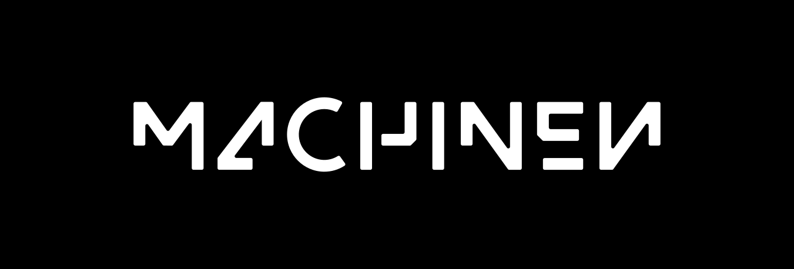

<p align="center">
  
</p>

<h1 align="center">M A C H I N E N</h1>

**Your computer is already a cloud. Machinen makes it feel like one.**

You already have machines: one on your lap, one on your desk, maybe one
humming in a closet. Machinen gives you small, named Linux VMs on the
hardware you control. They run in the background, keep terminal sessions
alive, and let you reconnect from another shell later.

No tiny rented slice. No hyperscaler-shaped workflow. Just cloud-shaped
computers that belong to you.

Under the hood, Machinen is a native microVM runtime: arm64 on Apple
Silicon/Linux and amd64 on Linux/KVM. Node.js is the first-class target;
Python, bash, and anything else that boots in a Linux VM works too. When
you need the weird stuff, you can snapshot, fork, and hand off a running
VM between hosts.

## The loop

Start a little Linux machine, detach from it, and come back later:

```bash
npx machinen boot --name work --detach -- sleep infinity
npx machinen attach work

# from another terminal, another SSH session, or after your client drops:
npx machinen attach work
```

`attach` opens a real PTY with job control, tab completion, full-screen
TUIs, and Ctrl-C going to the guest. By default it creates or reconnects
a persistent session named `default`; if your host terminal or SSH
connection disappears, the shell keeps running inside the VM.

```bash
npx machinen attach --session editor work   # another persistent terminal
npx machinen sessions work                  # list live sessions
npx machinen session-kill work editor       # reset one session
npx machinen stop work                      # shut down the VM
```

## Install

```bash
npm i @machinen/cli @machinen/runtime
```

Then run the CLI with `npx machinen …` (or the shorter `npx mn …` — both
names install). Prefer it on your PATH? `npm i -g @machinen/cli` is fine
too.

The right native package is pulled automatically via optional dependencies:
`@machinen/native-arm64-darwin` on Apple Silicon Macs,
`@machinen/native-arm64-linux` on arm64 Linux, and
`@machinen/native-x64-linux` on amd64 Linux. No system dependencies.

First run fetches the matching kernel + rootfs from a GitHub release on the
companion repo over plain HTTPS — no auth required.

## Quickstart: a tiny service you own

Bake an image, boot it as a named VM, and let it accumulate state on your
machine.

### 1. Bake

A tiny HTTP server that counts hits in memory:

```js
// counter.mjs
import { createServer } from "node:http";
let count = 0;
createServer((_, res) => {
  res.end(JSON.stringify({ count: ++count }) + "\n");
}).listen(3000);
```

Bake it into a rootfs tarball with `provision()`:

```ts
// bake.ts
import { readFileSync } from "node:fs";
import { provision } from "@machinen/runtime";

await provision({
  install: async (vm) => {
    await vm.exec("apt-get update && apt-get install -y nodejs");
    await vm.writeFile("/opt/counter.mjs", readFileSync("./counter.mjs"));
  },
  cmd: ["/usr/bin/node", "/opt/counter.mjs"],
  out: "./counter.tar.gz",
});
```

```bash
node bake.ts
```

### 2. Boot

```bash
npx machinen boot --name counter -p 3000:3000 --detach ./counter.tar.gz
curl localhost:3000                        # { count: 1 }
curl localhost:3000                        # { count: 2 }
```

The service is now running in a named VM on your machine. The boot command
has returned, but the VM, the TCP forward, and the guest exec agent are
still alive in the background.

Reach into it whenever you want:

```bash
npx machinen exec counter -- ps aux         # one-off command
npx machinen attach counter                 # reconnectable shell/TUI
```

### 3. Hand it off when you want

Freeze the VM, copy the bundle to host B, and thaw it there:

```bash
npx machinen snapshot counter ./counter.snap
scp -r ./counter.snap host-b:
ssh host-b npx machinen restore ./counter.snap -p 3000:3000 &
curl host-b:3000                           # { count: 3 }  ← same process
```

Same guest architecture only (arm64 ↔ arm64, amd64 ↔ amd64). Cross-ISA
restore is not supported. The default vmstate snapshot bundle includes CPU
state, memory, device state, and the root block image needed to restore the
VM.

## Fork

`fork` is snapshot + restore without killing the source. The original keeps
running; you get a sibling VM with the same heap, same open files, and a
copy-on-write disk. Both processes diverge from the same instant.

Pick up from Step 2 above — `counter` is running with `count = 2`:

```bash
npx machinen fork counter --new-name counter-b --detach

npx machinen exec counter   -- curl -s localhost:3000   # { count: 3 }
npx machinen exec counter-b -- curl -s localhost:3000   # { count: 3 }
npx machinen exec counter-b -- curl -s localhost:3000   # { count: 4 }
npx machinen exec counter   -- curl -s localhost:3000   # { count: 4 }
```

Both VMs branched from the same `count = 2` heap and now count
independently. Use it to clone a warmed-up process: a database with caches
loaded, a test fixture in exactly the right state, a long-running compute
job branched into N parallel explorations.

The fork doesn't inherit the source's `-p` host forwards — host ports are
global, only one process can bind each one. Two ways to reach a fork:

```bash
# A) exec over vsock — works for any guest port, no host forward needed.
npx machinen exec counter-b -- curl -s localhost:3000

# B) -p with non-conflicting host ports — forwards on the host.
npx machinen fork counter --new-name counter-b -p 3001:3000 --detach
curl localhost:3001                                            # the fork
curl localhost:3000                                            # still the source
```

Pass `-p` multiple times for multiple ports. If you pick a host port the
source is already forwarding, `fork` errors with `BOOT_PORT_FORWARD_IN_USE`
and names the VM that's holding it.

From Node, same shape:

```ts
const fork = await vm.fork({ name: "counter-b" });
```

## From Node

Same primitives, driven from TypeScript:

```ts
import { readFileSync } from "node:fs";
import { boot, provision, restore } from "@machinen/runtime";

await provision({
  install: async (vm) => {
    await vm.exec("apt-get update && apt-get install -y nodejs");
    await vm.writeFile("/opt/counter.mjs", readFileSync("./counter.mjs"));
  },
  cmd: ["/usr/bin/node", "/opt/counter.mjs"],
  out: "./counter.tar.gz",
});

const vm = await boot({ image: "./counter.tar.gz", name: "counter", detached: true });
// ... let it run, serve traffic, accumulate state ...

await vm.snapshot({ outDir: "./counter.snap" });

// elsewhere (possibly on another host):
const restored = await restore({ snapDir: "./counter.snap" });
```

## Documentation

- [Quickstart](./docs/quickstart.md) — a longer bake → boot → handoff
  walkthrough
- [Try Command Code in an isolated VM](./docs/guides/command-code-vm.md) —
  Node 24, npm, a live workspace mount, and host-mounted agent state
- [Create a VM](./docs/guides/create-a-vm.md) — boot, detach, attach,
  and manage named VMs
- [Hand off a running VM](./docs/guides/handoff.md) — snapshot → transfer → restore
- [Guides](./docs/) — recipes for creating VMs, snapshots and forks,
  mounts, and networking
- [`@machinen/cli` reference](./packages/cli/API.md) — command and flag reference
- [`@machinen/runtime` reference](./packages/runtime/API.md) — every
  exported function, type, and error class (typedoc-generated)

## Run a recipe without installing

`npx` can download the CLI package and run a signed recipe directly:

```bash
npx @machinen/cli run claude-code                         # official-name shorthand
npx @machinen/cli run machinen.dev/run/claude-code        # full recipe URL
npx @machinen/cli run codex --session work                # reconnectable session
npx @machinen/cli run list                                 # signed recipe registry
```

## Other ways to boot

```bash
npx machinen boot -- /bin/sh                    # ad-hoc: boot base + run a cmd
npx machinen boot ./my-image.tar.gz             # boot a provisioned rootfs tarball
npx machinen install                            # pre-fetch base assets (CI / airgap)
npx machinen install --version <tag>            # pin to a specific release tag
```

## Contributing

See [`CONTRIBUTING.md`](CONTRIBUTING.md) for setup, build, and local-run
instructions. Release mechanics are in [`RELEASING.md`](RELEASING.md).

## License

[FSL-1.1-MIT](./LICENSE) — Functional Source License. Converts to MIT two
years after each release.
